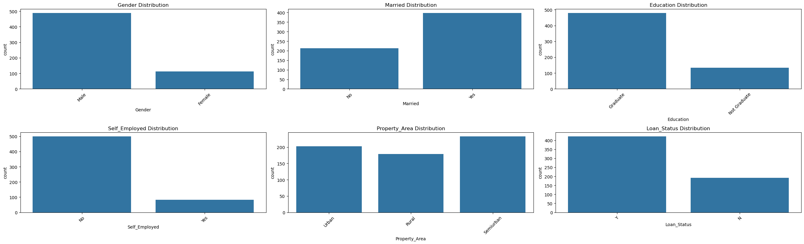

```python
import numpy as np
import pandas as pd
import matplotlib.pyplot as plt
import seaborn as sns
from sklearn.preprocessing import LabelEncoder
from sklearn.model_selection import train_test_split
!pip install xgboost
from xgboost import XGBRegressor
from sklearn import metrics
from sklearn.linear_model import LinearRegression, Ridge, Lasso, BayesianRidge
from sklearn.preprocessing import PolynomialFeatures, StandardScaler
from sklearn.svm import SVR
from sklearn.ensemble import RandomForestRegressor
from xgboost import XGBRegressor
from sklearn.pipeline import make_pipeline
from sklearn.metrics import mean_squared_error, mean_absolute_error, r2_score
from sklearn.model_selection import cross_val_score
from sklearn.model_selection import KFold
```

    Requirement already satisfied: xgboost in c:\users\dell\anaconda3\lib\site-packages (3.0.0)
    Requirement already satisfied: numpy in c:\users\dell\anaconda3\lib\site-packages (from xgboost) (1.26.4)
    Requirement already satisfied: scipy in c:\users\dell\anaconda3\lib\site-packages (from xgboost) (1.13.1)
    


```python
df=pd.read_csv(r'C:\Users\DELL\Desktop\Uday\Machine Learning\Loan Approval\loan_data_set.csv')
```


```python
df
```


<div>
<style scoped>
    .dataframe tbody tr th:only-of-type {
        vertical-align: middle;
    }

    .dataframe tbody tr th {
        vertical-align: top;
    }

    .dataframe thead th {
        text-align: right;
    }
</style>
<table border="1" class="dataframe">
  <thead>
    <tr style="text-align: right;">
      <th></th>
      <th>Loan_ID</th>
      <th>Gender</th>
      <th>Married</th>
      <th>Dependents</th>
      <th>Education</th>
      <th>Self_Employed</th>
      <th>ApplicantIncome</th>
      <th>CoapplicantIncome</th>
      <th>LoanAmount</th>
      <th>Loan_Amount_Term</th>
      <th>Credit_History</th>
      <th>Property_Area</th>
      <th>Loan_Status</th>
    </tr>
  </thead>
  <tbody>
    <tr>
      <th>0</th>
      <td>LP001002</td>
      <td>Male</td>
      <td>No</td>
      <td>0</td>
      <td>Graduate</td>
      <td>No</td>
      <td>5849</td>
      <td>0.0</td>
      <td>NaN</td>
      <td>360.0</td>
      <td>1.0</td>
      <td>Urban</td>
      <td>Y</td>
    </tr>
    <tr>
      <th>1</th>
      <td>LP001003</td>
      <td>Male</td>
      <td>Yes</td>
      <td>1</td>
      <td>Graduate</td>
      <td>No</td>
      <td>4583</td>
      <td>1508.0</td>
      <td>128.0</td>
      <td>360.0</td>
      <td>1.0</td>
      <td>Rural</td>
      <td>N</td>
    </tr>
    <tr>
      <th>2</th>
      <td>LP001005</td>
      <td>Male</td>
      <td>Yes</td>
      <td>0</td>
      <td>Graduate</td>
      <td>Yes</td>
      <td>3000</td>
      <td>0.0</td>
      <td>66.0</td>
      <td>360.0</td>
      <td>1.0</td>
      <td>Urban</td>
      <td>Y</td>
    </tr>
    <tr>
      <th>3</th>
      <td>LP001006</td>
      <td>Male</td>
      <td>Yes</td>
      <td>0</td>
      <td>Not Graduate</td>
      <td>No</td>
      <td>2583</td>
      <td>2358.0</td>
      <td>120.0</td>
      <td>360.0</td>
      <td>1.0</td>
      <td>Urban</td>
      <td>Y</td>
    </tr>
    <tr>
      <th>4</th>
      <td>LP001008</td>
      <td>Male</td>
      <td>No</td>
      <td>0</td>
      <td>Graduate</td>
      <td>No</td>
      <td>6000</td>
      <td>0.0</td>
      <td>141.0</td>
      <td>360.0</td>
      <td>1.0</td>
      <td>Urban</td>
      <td>Y</td>
    </tr>
    <tr>
      <th>...</th>
      <td>...</td>
      <td>...</td>
      <td>...</td>
      <td>...</td>
      <td>...</td>
      <td>...</td>
      <td>...</td>
      <td>...</td>
      <td>...</td>
      <td>...</td>
      <td>...</td>
      <td>...</td>
      <td>...</td>
    </tr>
    <tr>
      <th>609</th>
      <td>LP002978</td>
      <td>Female</td>
      <td>No</td>
      <td>0</td>
      <td>Graduate</td>
      <td>No</td>
      <td>2900</td>
      <td>0.0</td>
      <td>71.0</td>
      <td>360.0</td>
      <td>1.0</td>
      <td>Rural</td>
      <td>Y</td>
    </tr>
    <tr>
      <th>610</th>
      <td>LP002979</td>
      <td>Male</td>
      <td>Yes</td>
      <td>3+</td>
      <td>Graduate</td>
      <td>No</td>
      <td>4106</td>
      <td>0.0</td>
      <td>40.0</td>
      <td>180.0</td>
      <td>1.0</td>
      <td>Rural</td>
      <td>Y</td>
    </tr>
    <tr>
      <th>611</th>
      <td>LP002983</td>
      <td>Male</td>
      <td>Yes</td>
      <td>1</td>
      <td>Graduate</td>
      <td>No</td>
      <td>8072</td>
      <td>240.0</td>
      <td>253.0</td>
      <td>360.0</td>
      <td>1.0</td>
      <td>Urban</td>
      <td>Y</td>
    </tr>
    <tr>
      <th>612</th>
      <td>LP002984</td>
      <td>Male</td>
      <td>Yes</td>
      <td>2</td>
      <td>Graduate</td>
      <td>No</td>
      <td>7583</td>
      <td>0.0</td>
      <td>187.0</td>
      <td>360.0</td>
      <td>1.0</td>
      <td>Urban</td>
      <td>Y</td>
    </tr>
    <tr>
      <th>613</th>
      <td>LP002990</td>
      <td>Female</td>
      <td>No</td>
      <td>0</td>
      <td>Graduate</td>
      <td>Yes</td>
      <td>4583</td>
      <td>0.0</td>
      <td>133.0</td>
      <td>360.0</td>
      <td>0.0</td>
      <td>Semiurban</td>
      <td>N</td>
    </tr>
  </tbody>
</table>
<p>614 rows × 13 columns</p>
</div>


```python
df.isnull().sum()
```


    Loan_ID               0
    Gender               13
    Married               3
    Dependents           15
    Education             0
    Self_Employed        32
    ApplicantIncome       0
    CoapplicantIncome     0
    LoanAmount           22
    Loan_Amount_Term     14
    Credit_History       50
    Property_Area         0
    Loan_Status           0
    dtype: int64


```python
df.info()
```

    <class 'pandas.core.frame.DataFrame'>
    RangeIndex: 614 entries, 0 to 613
    Data columns (total 13 columns):
     #   Column             Non-Null Count  Dtype  
    ---  ------             --------------  -----  
     0   Loan_ID            614 non-null    object 
     1   Gender             601 non-null    object 
     2   Married            611 non-null    object 
     3   Dependents         599 non-null    object 
     4   Education          614 non-null    object 
     5   Self_Employed      582 non-null    object 
     6   ApplicantIncome    614 non-null    int64  
     7   CoapplicantIncome  614 non-null    float64
     8   LoanAmount         592 non-null    float64
     9   Loan_Amount_Term   600 non-null    float64
     10  Credit_History     564 non-null    float64
     11  Property_Area      614 non-null    object 
     12  Loan_Status        614 non-null    object 
    dtypes: float64(4), int64(1), object(8)
    memory usage: 62.5+ KB
    


```python
df.describe()
```


<div>
<style scoped>
    .dataframe tbody tr th:only-of-type {
        vertical-align: middle;
    }

    .dataframe tbody tr th {
        vertical-align: top;
    }

    .dataframe thead th {
        text-align: right;
    }
</style>
<table border="1" class="dataframe">
  <thead>
    <tr style="text-align: right;">
      <th></th>
      <th>ApplicantIncome</th>
      <th>CoapplicantIncome</th>
      <th>LoanAmount</th>
      <th>Loan_Amount_Term</th>
      <th>Credit_History</th>
    </tr>
  </thead>
  <tbody>
    <tr>
      <th>count</th>
      <td>614.000000</td>
      <td>614.000000</td>
      <td>592.000000</td>
      <td>600.00000</td>
      <td>564.000000</td>
    </tr>
    <tr>
      <th>mean</th>
      <td>5403.459283</td>
      <td>1621.245798</td>
      <td>146.412162</td>
      <td>342.00000</td>
      <td>0.842199</td>
    </tr>
    <tr>
      <th>std</th>
      <td>6109.041673</td>
      <td>2926.248369</td>
      <td>85.587325</td>
      <td>65.12041</td>
      <td>0.364878</td>
    </tr>
    <tr>
      <th>min</th>
      <td>150.000000</td>
      <td>0.000000</td>
      <td>9.000000</td>
      <td>12.00000</td>
      <td>0.000000</td>
    </tr>
    <tr>
      <th>25%</th>
      <td>2877.500000</td>
      <td>0.000000</td>
      <td>100.000000</td>
      <td>360.00000</td>
      <td>1.000000</td>
    </tr>
    <tr>
      <th>50%</th>
      <td>3812.500000</td>
      <td>1188.500000</td>
      <td>128.000000</td>
      <td>360.00000</td>
      <td>1.000000</td>
    </tr>
    <tr>
      <th>75%</th>
      <td>5795.000000</td>
      <td>2297.250000</td>
      <td>168.000000</td>
      <td>360.00000</td>
      <td>1.000000</td>
    </tr>
    <tr>
      <th>max</th>
      <td>81000.000000</td>
      <td>41667.000000</td>
      <td>700.000000</td>
      <td>480.00000</td>
      <td>1.000000</td>
    </tr>
  </tbody>
</table>
</div>


```python
Numeric_cols = ['ApplicantIncome', 'CoapplicantIncome', 'LoanAmount', 
                'Loan_Amount_Term', 'Credit_History']

# Adjust figure size
plt.figure(figsize=(15, 12))  

for i, col in enumerate(Numeric_cols):
    plt.subplot(2, 3, i+1)  # Create subplots in a 3x3 grid
    sns.histplot(data=df, x=col, kde=True)  # Add KDE for better distribution visualization
    plt.title(f'{col} Distribution')  # Title for each subplot
    plt.xticks(rotation=45)
    plt.tight_layout()

plt.show()
```


    

    


```python
Numeric_cols = ['ApplicantIncome', 'CoapplicantIncome', 'LoanAmount', 
                'Loan_Amount_Term', 'Credit_History']

# Adjust figure size
plt.figure(figsize=(15, 12))  

for i, col in enumerate(Numeric_cols):
    plt.subplot(2, 3, i+1)  # Create subplots in a 3x3 grid
    sns.boxplot(data=df, y=col)  # Add KDE for better distribution visualization
    plt.title(f'{col} Distribution')  # Title for each subplot
    plt.xticks(rotation=45)
    plt.tight_layout()

plt.show()
```


    

    


```python
Numeric_cols = ['Gender', 'Married', 
                'Education', 'Self_Employed','Property_Area','Loan_Status']

# Adjust figure size
plt.figure(figsize=(26, 8))  

for i, col in enumerate(Numeric_cols):
    plt.subplot(2, 3, i+1)  # Create subplots in a 1x5 grid
    sns.countplot(data=df, x=col)  # to see outliers
    plt.title(f'{col} Distribution')  # Title for each subplot
    plt.xticks(rotation=45)
    plt.tight_layout()

plt.show()
```


    

    


```python
# change dependent col 3+ to 4 and plot the distrinutoion cuntplot if needed
# remove outliers
# transform data to normal
# remove null values
```


```python
df.duplicated().sum()
```


    0


```python
df[df.duplicated()]
```


<div>
<style scoped>
    .dataframe tbody tr th:only-of-type {
        vertical-align: middle;
    }

    .dataframe tbody tr th {
        vertical-align: top;
    }

    .dataframe thead th {
        text-align: right;
    }
</style>
<table border="1" class="dataframe">
  <thead>
    <tr style="text-align: right;">
      <th></th>
      <th>Loan_ID</th>
      <th>Gender</th>
      <th>Married</th>
      <th>Dependents</th>
      <th>Education</th>
      <th>Self_Employed</th>
      <th>ApplicantIncome</th>
      <th>CoapplicantIncome</th>
      <th>LoanAmount</th>
      <th>Loan_Amount_Term</th>
      <th>Credit_History</th>
      <th>Property_Area</th>
      <th>Loan_Status</th>
    </tr>
  </thead>
  <tbody>
  </tbody>
</table>
</div>


```python
df['Credit_History'].unique()
```


    array([ 1.,  0., nan])


```python
# credit history cant fill so droping na rows
```


```python
df = df.dropna(subset=['Credit_History'])
```


```python
df.isnull().sum()
```


    Loan_ID               0
    Gender               12
    Married               3
    Dependents           15
    Education             0
    Self_Employed        26
    ApplicantIncome       0
    CoapplicantIncome     0
    LoanAmount           21
    Loan_Amount_Term     14
    Credit_History        0
    Property_Area         0
    Loan_Status           0
    dtype: int64


```python
# replacing na with mode in Loan_Amount_Term col
```


```python
df['Loan_Amount_Term']= df['Loan_Amount_Term'].fillna(df['Loan_Amount_Term'].mode()[0])
```

    C:\Users\DELL\AppData\Local\Temp\ipykernel_18192\1743723499.py:1: SettingWithCopyWarning: 
    A value is trying to be set on a copy of a slice from a DataFrame.
    Try using .loc[row_indexer,col_indexer] = value instead
    
    See the caveats in the documentation: https://pandas.pydata.org/pandas-docs/stable/user_guide/indexing.html#returning-a-view-versus-a-copy
      df['Loan_Amount_Term']= df['Loan_Amount_Term'].fillna(df['Loan_Amount_Term'].mode()[0])
    


```python
df.isnull().sum()
```


    Loan_ID               0
    Gender               12
    Married               3
    Dependents           15
    Education             0
    Self_Employed        26
    ApplicantIncome       0
    CoapplicantIncome     0
    LoanAmount           21
    Loan_Amount_Term      0
    Credit_History        0
    Property_Area         0
    Loan_Status           0
    dtype: int64


```python
df['Self_Employed']= df['Self_Employed'].fillna(df['Self_Employed'].mode()[0])
```

    C:\Users\DELL\AppData\Local\Temp\ipykernel_18192\1659637598.py:1: SettingWithCopyWarning: 
    A value is trying to be set on a copy of a slice from a DataFrame.
    Try using .loc[row_indexer,col_indexer] = value instead
    
    See the caveats in the documentation: https://pandas.pydata.org/pandas-docs/stable/user_guide/indexing.html#returning-a-view-versus-a-copy
      df['Self_Employed']= df['Self_Employed'].fillna(df['Self_Employed'].mode()[0])
    


```python
df.isnull().sum()
```


    Loan_ID               0
    Gender               12
    Married               3
    Dependents           15
    Education             0
    Self_Employed         0
    ApplicantIncome       0
    CoapplicantIncome     0
    LoanAmount           21
    Loan_Amount_Term      0
    Credit_History        0
    Property_Area         0
    Loan_Status           0
    dtype: int64


```python
df['Dependents'].unique()
```


    array(['0', '1', '2', '3+', nan], dtype=object)


```python
Mapping = {'3+': 4}
df['Dependents'].replace(Mapping, inplace=True)
```

    C:\Users\DELL\AppData\Local\Temp\ipykernel_18192\1752178804.py:2: SettingWithCopyWarning: 
    A value is trying to be set on a copy of a slice from a DataFrame
    
    See the caveats in the documentation: https://pandas.pydata.org/pandas-docs/stable/user_guide/indexing.html#returning-a-view-versus-a-copy
      df['Dependents'].replace(Mapping, inplace=True)
    


```python
df['Dependents'].unique()
```


    array(['0', '1', '2', 4, nan], dtype=object)


```python
Mapping = {'1.': 1, '0.':0,'2.':2,'4.':4}
df['Dependents'].replace(Mapping, inplace=True)
```

    C:\Users\DELL\AppData\Local\Temp\ipykernel_18192\3754493662.py:2: SettingWithCopyWarning: 
    A value is trying to be set on a copy of a slice from a DataFrame
    
    See the caveats in the documentation: https://pandas.pydata.org/pandas-docs/stable/user_guide/indexing.html#returning-a-view-versus-a-copy
      df['Dependents'].replace(Mapping, inplace=True)
    


```python
df['Dependents'].unique()
```


    array([ 0.,  1.,  2.,  4., nan])


```python
df['Dependents']= df['Dependents'].fillna(df['Dependents'].mode()[0])
```

    C:\Users\DELL\AppData\Local\Temp\ipykernel_18192\3535200463.py:1: SettingWithCopyWarning: 
    A value is trying to be set on a copy of a slice from a DataFrame.
    Try using .loc[row_indexer,col_indexer] = value instead
    
    See the caveats in the documentation: https://pandas.pydata.org/pandas-docs/stable/user_guide/indexing.html#returning-a-view-versus-a-copy
      df['Dependents']= df['Dependents'].fillna(df['Dependents'].mode()[0])
    


```python
df.isnull().sum()
```


    Loan_ID               0
    Gender               12
    Married               3
    Dependents            0
    Education             0
    Self_Employed         0
    ApplicantIncome       0
    CoapplicantIncome     0
    LoanAmount           21
    Loan_Amount_Term      0
    Credit_History        0
    Property_Area         0
    Loan_Status           0
    dtype: int64


```python
df['Dependents'].unique()
```


    array([0., 1., 2., 4.])


```python
df['Dependents']=df['Dependents'].astype(int)
```

    C:\Users\DELL\AppData\Local\Temp\ipykernel_18192\6451118.py:1: SettingWithCopyWarning: 
    A value is trying to be set on a copy of a slice from a DataFrame.
    Try using .loc[row_indexer,col_indexer] = value instead
    
    See the caveats in the documentation: https://pandas.pydata.org/pandas-docs/stable/user_guide/indexing.html#returning-a-view-versus-a-copy
      df['Dependents']=df['Dependents'].astype(int)
    


```python
type(df['Dependents'])
```


    pandas.core.series.Series


```python
df['Dependents']
```


    0      0
    1      1
    2      0
    3      0
    4      0
          ..
    609    0
    610    4
    611    1
    612    2
    613    0
    Name: Dependents, Length: 564, dtype: int32


```python
sns.histplot(data=df, x='Dependents', kde=True)
```


    <Axes: xlabel='Dependents', ylabel='Count'>


    

    


```python
df.isnull().sum()

```


    Loan_ID               0
    Gender               12
    Married               3
    Dependents            0
    Education             0
    Self_Employed         0
    ApplicantIncome       0
    CoapplicantIncome     0
    LoanAmount           21
    Loan_Amount_Term      0
    Credit_History        0
    Property_Area         0
    Loan_Status           0
    dtype: int64


```python
df['LoanAmount']= df['LoanAmount'].fillna(df['LoanAmount'].mode()[0])
```

    C:\Users\DELL\AppData\Local\Temp\ipykernel_18192\1078356362.py:1: SettingWithCopyWarning: 
    A value is trying to be set on a copy of a slice from a DataFrame.
    Try using .loc[row_indexer,col_indexer] = value instead
    
    See the caveats in the documentation: https://pandas.pydata.org/pandas-docs/stable/user_guide/indexing.html#returning-a-view-versus-a-copy
      df['LoanAmount']= df['LoanAmount'].fillna(df['LoanAmount'].mode()[0])
    


```python
df.isnull().sum()
```


    Loan_ID               0
    Gender               12
    Married               3
    Dependents            0
    Education             0
    Self_Employed         0
    ApplicantIncome       0
    CoapplicantIncome     0
    LoanAmount            0
    Loan_Amount_Term      0
    Credit_History        0
    Property_Area         0
    Loan_Status           0
    dtype: int64


```python
df = df.dropna(subset=['Gender','Married'])
```


```python
df.isnull().sum()
```


    Loan_ID              0
    Gender               0
    Married              0
    Dependents           0
    Education            0
    Self_Employed        0
    ApplicantIncome      0
    CoapplicantIncome    0
    LoanAmount           0
    Loan_Amount_Term     0
    Credit_History       0
    Property_Area        0
    Loan_Status          0
    dtype: int64


```python
df.info()
```

    <class 'pandas.core.frame.DataFrame'>
    Index: 549 entries, 0 to 613
    Data columns (total 13 columns):
     #   Column             Non-Null Count  Dtype  
    ---  ------             --------------  -----  
     0   Loan_ID            549 non-null    object 
     1   Gender             549 non-null    object 
     2   Married            549 non-null    object 
     3   Dependents         549 non-null    int32  
     4   Education          549 non-null    object 
     5   Self_Employed      549 non-null    object 
     6   ApplicantIncome    549 non-null    int64  
     7   CoapplicantIncome  549 non-null    float64
     8   LoanAmount         549 non-null    float64
     9   Loan_Amount_Term   549 non-null    float64
     10  Credit_History     549 non-null    float64
     11  Property_Area      549 non-null    object 
     12  Loan_Status        549 non-null    object 
    dtypes: float64(4), int32(1), int64(1), object(7)
    memory usage: 57.9+ KB
    


```python
df.head()
```


<div>
<style scoped>
    .dataframe tbody tr th:only-of-type {
        vertical-align: middle;
    }

    .dataframe tbody tr th {
        vertical-align: top;
    }

    .dataframe thead th {
        text-align: right;
    }
</style>
<table border="1" class="dataframe">
  <thead>
    <tr style="text-align: right;">
      <th></th>
      <th>Loan_ID</th>
      <th>Gender</th>
      <th>Married</th>
      <th>Dependents</th>
      <th>Education</th>
      <th>Self_Employed</th>
      <th>ApplicantIncome</th>
      <th>CoapplicantIncome</th>
      <th>LoanAmount</th>
      <th>Loan_Amount_Term</th>
      <th>Credit_History</th>
      <th>Property_Area</th>
      <th>Loan_Status</th>
    </tr>
  </thead>
  <tbody>
    <tr>
      <th>0</th>
      <td>LP001002</td>
      <td>Male</td>
      <td>No</td>
      <td>0</td>
      <td>Graduate</td>
      <td>No</td>
      <td>5849</td>
      <td>0.0</td>
      <td>120.0</td>
      <td>360.0</td>
      <td>1.0</td>
      <td>Urban</td>
      <td>Y</td>
    </tr>
    <tr>
      <th>1</th>
      <td>LP001003</td>
      <td>Male</td>
      <td>Yes</td>
      <td>1</td>
      <td>Graduate</td>
      <td>No</td>
      <td>4583</td>
      <td>1508.0</td>
      <td>128.0</td>
      <td>360.0</td>
      <td>1.0</td>
      <td>Rural</td>
      <td>N</td>
    </tr>
    <tr>
      <th>2</th>
      <td>LP001005</td>
      <td>Male</td>
      <td>Yes</td>
      <td>0</td>
      <td>Graduate</td>
      <td>Yes</td>
      <td>3000</td>
      <td>0.0</td>
      <td>66.0</td>
      <td>360.0</td>
      <td>1.0</td>
      <td>Urban</td>
      <td>Y</td>
    </tr>
    <tr>
      <th>3</th>
      <td>LP001006</td>
      <td>Male</td>
      <td>Yes</td>
      <td>0</td>
      <td>Not Graduate</td>
      <td>No</td>
      <td>2583</td>
      <td>2358.0</td>
      <td>120.0</td>
      <td>360.0</td>
      <td>1.0</td>
      <td>Urban</td>
      <td>Y</td>
    </tr>
    <tr>
      <th>4</th>
      <td>LP001008</td>
      <td>Male</td>
      <td>No</td>
      <td>0</td>
      <td>Graduate</td>
      <td>No</td>
      <td>6000</td>
      <td>0.0</td>
      <td>141.0</td>
      <td>360.0</td>
      <td>1.0</td>
      <td>Urban</td>
      <td>Y</td>
    </tr>
  </tbody>
</table>
</div>


```python
# 1. Correlation Matrix Heatmap

Numeric_cols =  ['Dependents','ApplicantIncome', 'CoapplicantIncome', 'LoanAmount', 
                'Loan_Amount_Term', 'Credit_History']

# Compute the correlation matrix
corr_matrix = df[Numeric_cols].corr()

# Plot the heatmap
plt.figure(figsize=(8, 6))
sns.heatmap(corr_matrix, annot=True, cmap='coolwarm', fmt=".2f")
plt.title('Correlation Matrix')
plt.tight_layout()
plt.show()
```


    

    


```python
# we should test withoutliers then compare with tranformation sq and log (log supresses the impact of big values/ outliers more than sq), then 
# we should also test by removing in reality. for this project i am moving forward with removing the outliers. As rest both are iterative and simpler 
# to follw. 
```


```python
columns_with_outliers = ['ApplicantIncome', 'CoapplicantIncome', 'LoanAmount']

# Copy the original DataFrame to avoid overwriting it
df_clean = df.copy()

# Loop through each column and apply IQR filtering
for col in columns_with_outliers:
    Q1 = df_clean[col].quantile(0.25)
    Q3 = df_clean[col].quantile(0.75)
    IQR = Q3 - Q1
    lower_bound = Q1 - 1.5 * IQR
    upper_bound = Q3 + 1.5 * IQR
    
    # Filter out the outliers
    df_clean = df_clean[(df_clean[col] >= lower_bound) & (df_clean[col] <= upper_bound)]

```


```python
df_clean.head()
```


<div>
<style scoped>
    .dataframe tbody tr th:only-of-type {
        vertical-align: middle;
    }

    .dataframe tbody tr th {
        vertical-align: top;
    }

    .dataframe thead th {
        text-align: right;
    }
</style>
<table border="1" class="dataframe">
  <thead>
    <tr style="text-align: right;">
      <th></th>
      <th>Loan_ID</th>
      <th>Gender</th>
      <th>Married</th>
      <th>Dependents</th>
      <th>Education</th>
      <th>Self_Employed</th>
      <th>ApplicantIncome</th>
      <th>CoapplicantIncome</th>
      <th>LoanAmount</th>
      <th>Loan_Amount_Term</th>
      <th>Credit_History</th>
      <th>Property_Area</th>
      <th>Loan_Status</th>
    </tr>
  </thead>
  <tbody>
    <tr>
      <th>0</th>
      <td>LP001002</td>
      <td>Male</td>
      <td>No</td>
      <td>0</td>
      <td>Graduate</td>
      <td>No</td>
      <td>5849</td>
      <td>0.0</td>
      <td>120.0</td>
      <td>360.0</td>
      <td>1.0</td>
      <td>Urban</td>
      <td>Y</td>
    </tr>
    <tr>
      <th>1</th>
      <td>LP001003</td>
      <td>Male</td>
      <td>Yes</td>
      <td>1</td>
      <td>Graduate</td>
      <td>No</td>
      <td>4583</td>
      <td>1508.0</td>
      <td>128.0</td>
      <td>360.0</td>
      <td>1.0</td>
      <td>Rural</td>
      <td>N</td>
    </tr>
    <tr>
      <th>2</th>
      <td>LP001005</td>
      <td>Male</td>
      <td>Yes</td>
      <td>0</td>
      <td>Graduate</td>
      <td>Yes</td>
      <td>3000</td>
      <td>0.0</td>
      <td>66.0</td>
      <td>360.0</td>
      <td>1.0</td>
      <td>Urban</td>
      <td>Y</td>
    </tr>
    <tr>
      <th>3</th>
      <td>LP001006</td>
      <td>Male</td>
      <td>Yes</td>
      <td>0</td>
      <td>Not Graduate</td>
      <td>No</td>
      <td>2583</td>
      <td>2358.0</td>
      <td>120.0</td>
      <td>360.0</td>
      <td>1.0</td>
      <td>Urban</td>
      <td>Y</td>
    </tr>
    <tr>
      <th>4</th>
      <td>LP001008</td>
      <td>Male</td>
      <td>No</td>
      <td>0</td>
      <td>Graduate</td>
      <td>No</td>
      <td>6000</td>
      <td>0.0</td>
      <td>141.0</td>
      <td>360.0</td>
      <td>1.0</td>
      <td>Urban</td>
      <td>Y</td>
    </tr>
  </tbody>
</table>
</div>


```python
df_clean.shape
```


    (464, 13)


```python
Numeric_cols = ['ApplicantIncome', 'CoapplicantIncome', 'LoanAmount']
                

# Adjust figure size
plt.figure(figsize=(15, 12))  

for i, col in enumerate(Numeric_cols):
    plt.subplot(2, 3, i+1)  # Create subplots in a 3x3 grid
    sns.histplot(data=df_clean, x=col, kde=True)  # Add KDE for better distribution visualization
    plt.title(f'{col} Distribution')  # Title for each subplot
    plt.xticks(rotation=45)
    plt.tight_layout()

plt.show()
```


    

    


```python
Numeric_cols = ['ApplicantIncome', 'CoapplicantIncome', 'LoanAmount']
                

# Adjust figure size
plt.figure(figsize=(15, 12))  

for i, col in enumerate(Numeric_cols):
    plt.subplot(2, 3, i+1)  # Create subplots in a 3x3 grid
    sns.boxplot(data=df_clean, y=col)  # Add KDE for better distribution visualization
    plt.title(f'{col} Distribution')  # Title for each subplot
    plt.xticks(rotation=45)
    plt.tight_layout()

plt.show()
```


    

    


```python
df.head(5)
df.shape
```


    (549, 13)


```python
log traformation keep data and minimize outlier effect - to see
```


```python
# Visualizing original data distribution
plt.figure(figsize=(10, 6))
sns.histplot(df['ApplicantIncome'], kde=True)
plt.title("Original ApplicantIncome Distribution")
plt.show()

# Log transformation (log(x + 1) to avoid log(0) issues)
df['Log_ApplicantIncome'] = np.log(df['ApplicantIncome'] + 1)

# Visualizing transformed data distribution
plt.figure(figsize=(10, 6))
sns.histplot(df['Log_ApplicantIncome'], kde=True)
plt.title("Log Transformed ApplicantIncome Distribution")
plt.show()

# Display the transformed DataFrame
print(df)

```


    

    


    

    


          Loan_ID  Gender Married  Dependents     Education Self_Employed  \
    0    LP001002    Male      No           0      Graduate            No   
    1    LP001003    Male     Yes           1      Graduate            No   
    2    LP001005    Male     Yes           0      Graduate           Yes   
    3    LP001006    Male     Yes           0  Not Graduate            No   
    4    LP001008    Male      No           0      Graduate            No   
    ..        ...     ...     ...         ...           ...           ...   
    609  LP002978  Female      No           0      Graduate            No   
    610  LP002979    Male     Yes           4      Graduate            No   
    611  LP002983    Male     Yes           1      Graduate            No   
    612  LP002984    Male     Yes           2      Graduate            No   
    613  LP002990  Female      No           0      Graduate           Yes   
    
         ApplicantIncome  CoapplicantIncome  LoanAmount  Loan_Amount_Term  \
    0               5849                0.0       120.0             360.0   
    1               4583             1508.0       128.0             360.0   
    2               3000                0.0        66.0             360.0   
    3               2583             2358.0       120.0             360.0   
    4               6000                0.0       141.0             360.0   
    ..               ...                ...         ...               ...   
    609             2900                0.0        71.0             360.0   
    610             4106                0.0        40.0             180.0   
    611             8072              240.0       253.0             360.0   
    612             7583                0.0       187.0             360.0   
    613             4583                0.0       133.0             360.0   
    
         Credit_History Property_Area Loan_Status  Log_ApplicantIncome  
    0               1.0         Urban           Y             8.674197  
    1               1.0         Rural           N             8.430327  
    2               1.0         Urban           Y             8.006701  
    3               1.0         Urban           Y             7.857094  
    4               1.0         Urban           Y             8.699681  
    ..              ...           ...         ...                  ...  
    609             1.0         Rural           Y             7.972811  
    610             1.0         Rural           Y             8.320448  
    611             1.0         Urban           Y             8.996280  
    612             1.0         Urban           Y             8.933796  
    613             0.0     Semiurban           N             8.430327  
    
    [549 rows x 14 columns]
    


```python
# for all usnig loop
```


```python

# List of columns to apply log transformation to
columns_to_transform = ['ApplicantIncome', 'CoapplicantIncome', 'LoanAmount']

# Loop through the columns and apply log transformation
for col in columns_to_transform:
    # Apply Log Transformation (log(x + 1)) to avoid log(0) issues
    df[f'Log_{col}'] = np.log(df[col] + 1)

# Visualizing the log transformation for all columns
for col in columns_to_transform:
    plt.figure(figsize=(12, 6))
    
    # Plot original vs log-transformed data
    plt.subplot(1, 2, 1)
    sns.histplot(df[col], kde=True)
    plt.title(f'Original {col} Distribution')
    
    plt.subplot(1, 2, 2)
    sns.histplot(df[f'Log_{col}'], kde=True, color='red')
    plt.title(f'Log Transformed {col} Distribution')
    
    plt.show()

# Display the transformed DataFrame
print(df)

```


    

    


    

    


    

    


          Loan_ID  Gender Married  Dependents     Education Self_Employed  \
    0    LP001002    Male      No           0      Graduate            No   
    1    LP001003    Male     Yes           1      Graduate            No   
    2    LP001005    Male     Yes           0      Graduate           Yes   
    3    LP001006    Male     Yes           0  Not Graduate            No   
    4    LP001008    Male      No           0      Graduate            No   
    ..        ...     ...     ...         ...           ...           ...   
    609  LP002978  Female      No           0      Graduate            No   
    610  LP002979    Male     Yes           4      Graduate            No   
    611  LP002983    Male     Yes           1      Graduate            No   
    612  LP002984    Male     Yes           2      Graduate            No   
    613  LP002990  Female      No           0      Graduate           Yes   
    
         ApplicantIncome  CoapplicantIncome  LoanAmount  Loan_Amount_Term  \
    0               5849                0.0       120.0             360.0   
    1               4583             1508.0       128.0             360.0   
    2               3000                0.0        66.0             360.0   
    3               2583             2358.0       120.0             360.0   
    4               6000                0.0       141.0             360.0   
    ..               ...                ...         ...               ...   
    609             2900                0.0        71.0             360.0   
    610             4106                0.0        40.0             180.0   
    611             8072              240.0       253.0             360.0   
    612             7583                0.0       187.0             360.0   
    613             4583                0.0       133.0             360.0   
    
         Credit_History Property_Area Loan_Status  Log_ApplicantIncome  \
    0               1.0         Urban           Y             8.674197   
    1               1.0         Rural           N             8.430327   
    2               1.0         Urban           Y             8.006701   
    3               1.0         Urban           Y             7.857094   
    4               1.0         Urban           Y             8.699681   
    ..              ...           ...         ...                  ...   
    609             1.0         Rural           Y             7.972811   
    610             1.0         Rural           Y             8.320448   
    611             1.0         Urban           Y             8.996280   
    612             1.0         Urban           Y             8.933796   
    613             0.0     Semiurban           N             8.430327   
    
         Log_CoapplicantIncome  Log_LoanAmount  
    0                 0.000000        4.795791  
    1                 7.319202        4.859812  
    2                 0.000000        4.204693  
    3                 7.765993        4.795791  
    4                 0.000000        4.955827  
    ..                     ...             ...  
    609               0.000000        4.276666  
    610               0.000000        3.713572  
    611               5.484797        5.537334  
    612               0.000000        5.236442  
    613               0.000000        4.897840  
    
    [549 rows x 16 columns]
    


```python
df.head()
```


<div>
<style scoped>
    .dataframe tbody tr th:only-of-type {
        vertical-align: middle;
    }

    .dataframe tbody tr th {
        vertical-align: top;
    }

    .dataframe thead th {
        text-align: right;
    }
</style>
<table border="1" class="dataframe">
  <thead>
    <tr style="text-align: right;">
      <th></th>
      <th>Loan_ID</th>
      <th>Gender</th>
      <th>Married</th>
      <th>Dependents</th>
      <th>Education</th>
      <th>Self_Employed</th>
      <th>ApplicantIncome</th>
      <th>CoapplicantIncome</th>
      <th>LoanAmount</th>
      <th>Loan_Amount_Term</th>
      <th>Credit_History</th>
      <th>Property_Area</th>
      <th>Loan_Status</th>
      <th>Log_ApplicantIncome</th>
    </tr>
  </thead>
  <tbody>
    <tr>
      <th>0</th>
      <td>LP001002</td>
      <td>Male</td>
      <td>No</td>
      <td>0</td>
      <td>Graduate</td>
      <td>No</td>
      <td>5849</td>
      <td>0.0</td>
      <td>120.0</td>
      <td>360.0</td>
      <td>1.0</td>
      <td>Urban</td>
      <td>Y</td>
      <td>8.674197</td>
    </tr>
    <tr>
      <th>1</th>
      <td>LP001003</td>
      <td>Male</td>
      <td>Yes</td>
      <td>1</td>
      <td>Graduate</td>
      <td>No</td>
      <td>4583</td>
      <td>1508.0</td>
      <td>128.0</td>
      <td>360.0</td>
      <td>1.0</td>
      <td>Rural</td>
      <td>N</td>
      <td>8.430327</td>
    </tr>
    <tr>
      <th>2</th>
      <td>LP001005</td>
      <td>Male</td>
      <td>Yes</td>
      <td>0</td>
      <td>Graduate</td>
      <td>Yes</td>
      <td>3000</td>
      <td>0.0</td>
      <td>66.0</td>
      <td>360.0</td>
      <td>1.0</td>
      <td>Urban</td>
      <td>Y</td>
      <td>8.006701</td>
    </tr>
    <tr>
      <th>3</th>
      <td>LP001006</td>
      <td>Male</td>
      <td>Yes</td>
      <td>0</td>
      <td>Not Graduate</td>
      <td>No</td>
      <td>2583</td>
      <td>2358.0</td>
      <td>120.0</td>
      <td>360.0</td>
      <td>1.0</td>
      <td>Urban</td>
      <td>Y</td>
      <td>7.857094</td>
    </tr>
    <tr>
      <th>4</th>
      <td>LP001008</td>
      <td>Male</td>
      <td>No</td>
      <td>0</td>
      <td>Graduate</td>
      <td>No</td>
      <td>6000</td>
      <td>0.0</td>
      <td>141.0</td>
      <td>360.0</td>
      <td>1.0</td>
      <td>Urban</td>
      <td>Y</td>
      <td>8.699681</td>
    </tr>
  </tbody>
</table>
</div>


```python

# List of columns to apply log transformation to
columns_to_transform = ['ApplicantIncome', 'CoapplicantIncome', 'LoanAmount']

# Apply log transformation and store results in new columns
for col in columns_to_transform:
    df[f'Log_{col}'] = np.log(df[col] + 1)

# Create a subplot grid
fig, axes = plt.subplots(3, 2, figsize=(18, 10))
axes = axes.flatten()  # Flatten the 2D axes array for easier indexing

# Loop to plot original and log-transformed data in a stacked manner
for idx, col in enumerate(columns_to_transform):
    # Plot original data
    sns.histplot(df[col], kde=True, ax=axes[2*idx])
    axes[2*idx].set_title(f'Original {col} Distribution')
    
    # Plot log-transformed data
    sns.histplot(df[f'Log_{col}'], kde=True, ax=axes[2*idx + 1], color='red')
    axes[2*idx + 1].set_title(f'Log Transformed {col} Distribution')

# Adjust layout for better spacing
plt.tight_layout()
plt.show()

# Display the transformed DataFrame
print(df)

```


    

    


          Loan_ID  Gender Married  Dependents     Education Self_Employed  \
    0    LP001002    Male      No           0      Graduate            No   
    1    LP001003    Male     Yes           1      Graduate            No   
    2    LP001005    Male     Yes           0      Graduate           Yes   
    3    LP001006    Male     Yes           0  Not Graduate            No   
    4    LP001008    Male      No           0      Graduate            No   
    ..        ...     ...     ...         ...           ...           ...   
    609  LP002978  Female      No           0      Graduate            No   
    610  LP002979    Male     Yes           4      Graduate            No   
    611  LP002983    Male     Yes           1      Graduate            No   
    612  LP002984    Male     Yes           2      Graduate            No   
    613  LP002990  Female      No           0      Graduate           Yes   
    
         ApplicantIncome  CoapplicantIncome  LoanAmount  Loan_Amount_Term  \
    0               5849                0.0       120.0             360.0   
    1               4583             1508.0       128.0             360.0   
    2               3000                0.0        66.0             360.0   
    3               2583             2358.0       120.0             360.0   
    4               6000                0.0       141.0             360.0   
    ..               ...                ...         ...               ...   
    609             2900                0.0        71.0             360.0   
    610             4106                0.0        40.0             180.0   
    611             8072              240.0       253.0             360.0   
    612             7583                0.0       187.0             360.0   
    613             4583                0.0       133.0             360.0   
    
         Credit_History Property_Area Loan_Status  Log_ApplicantIncome  \
    0               1.0         Urban           Y             8.674197   
    1               1.0         Rural           N             8.430327   
    2               1.0         Urban           Y             8.006701   
    3               1.0         Urban           Y             7.857094   
    4               1.0         Urban           Y             8.699681   
    ..              ...           ...         ...                  ...   
    609             1.0         Rural           Y             7.972811   
    610             1.0         Rural           Y             8.320448   
    611             1.0         Urban           Y             8.996280   
    612             1.0         Urban           Y             8.933796   
    613             0.0     Semiurban           N             8.430327   
    
         Log_CoapplicantIncome  Log_LoanAmount  
    0                 0.000000        4.795791  
    1                 7.319202        4.859812  
    2                 0.000000        4.204693  
    3                 7.765993        4.795791  
    4                 0.000000        4.955827  
    ..                     ...             ...  
    609               0.000000        4.276666  
    610               0.000000        3.713572  
    611               5.484797        5.537334  
    612               0.000000        5.236442  
    613               0.000000        4.897840  
    
    [549 rows x 16 columns]
    


```python
# labeling datasets
```


```python
col = ['Loan_ID' , 'Gender' , 'Married', 'Education', 'Self_Employed' , 'Property_Area','Loan_Status']

for i in col:
     # Fit the encoder on the column and transform them to integers
    label_encoder = LabelEncoder()
    df[i] = label_encoder.fit_transform(df[i])
```


```python
df
```


<div>
<style scoped>
    .dataframe tbody tr th:only-of-type {
        vertical-align: middle;
    }

    .dataframe tbody tr th {
        vertical-align: top;
    }

    .dataframe thead th {
        text-align: right;
    }
</style>
<table border="1" class="dataframe">
  <thead>
    <tr style="text-align: right;">
      <th></th>
      <th>Loan_ID</th>
      <th>Gender</th>
      <th>Married</th>
      <th>Dependents</th>
      <th>Education</th>
      <th>Self_Employed</th>
      <th>ApplicantIncome</th>
      <th>CoapplicantIncome</th>
      <th>LoanAmount</th>
      <th>Loan_Amount_Term</th>
      <th>Credit_History</th>
      <th>Property_Area</th>
      <th>Loan_Status</th>
      <th>Log_ApplicantIncome</th>
      <th>Log_CoapplicantIncome</th>
      <th>Log_LoanAmount</th>
    </tr>
  </thead>
  <tbody>
    <tr>
      <th>0</th>
      <td>0</td>
      <td>1</td>
      <td>0</td>
      <td>0</td>
      <td>0</td>
      <td>0</td>
      <td>5849</td>
      <td>0.0</td>
      <td>120.0</td>
      <td>360.0</td>
      <td>1.0</td>
      <td>2</td>
      <td>1</td>
      <td>8.674197</td>
      <td>0.000000</td>
      <td>4.795791</td>
    </tr>
    <tr>
      <th>1</th>
      <td>1</td>
      <td>1</td>
      <td>1</td>
      <td>1</td>
      <td>0</td>
      <td>0</td>
      <td>4583</td>
      <td>1508.0</td>
      <td>128.0</td>
      <td>360.0</td>
      <td>1.0</td>
      <td>0</td>
      <td>0</td>
      <td>8.430327</td>
      <td>7.319202</td>
      <td>4.859812</td>
    </tr>
    <tr>
      <th>2</th>
      <td>2</td>
      <td>1</td>
      <td>1</td>
      <td>0</td>
      <td>0</td>
      <td>1</td>
      <td>3000</td>
      <td>0.0</td>
      <td>66.0</td>
      <td>360.0</td>
      <td>1.0</td>
      <td>2</td>
      <td>1</td>
      <td>8.006701</td>
      <td>0.000000</td>
      <td>4.204693</td>
    </tr>
    <tr>
      <th>3</th>
      <td>3</td>
      <td>1</td>
      <td>1</td>
      <td>0</td>
      <td>1</td>
      <td>0</td>
      <td>2583</td>
      <td>2358.0</td>
      <td>120.0</td>
      <td>360.0</td>
      <td>1.0</td>
      <td>2</td>
      <td>1</td>
      <td>7.857094</td>
      <td>7.765993</td>
      <td>4.795791</td>
    </tr>
    <tr>
      <th>4</th>
      <td>4</td>
      <td>1</td>
      <td>0</td>
      <td>0</td>
      <td>0</td>
      <td>0</td>
      <td>6000</td>
      <td>0.0</td>
      <td>141.0</td>
      <td>360.0</td>
      <td>1.0</td>
      <td>2</td>
      <td>1</td>
      <td>8.699681</td>
      <td>0.000000</td>
      <td>4.955827</td>
    </tr>
    <tr>
      <th>...</th>
      <td>...</td>
      <td>...</td>
      <td>...</td>
      <td>...</td>
      <td>...</td>
      <td>...</td>
      <td>...</td>
      <td>...</td>
      <td>...</td>
      <td>...</td>
      <td>...</td>
      <td>...</td>
      <td>...</td>
      <td>...</td>
      <td>...</td>
      <td>...</td>
    </tr>
    <tr>
      <th>609</th>
      <td>544</td>
      <td>0</td>
      <td>0</td>
      <td>0</td>
      <td>0</td>
      <td>0</td>
      <td>2900</td>
      <td>0.0</td>
      <td>71.0</td>
      <td>360.0</td>
      <td>1.0</td>
      <td>0</td>
      <td>1</td>
      <td>7.972811</td>
      <td>0.000000</td>
      <td>4.276666</td>
    </tr>
    <tr>
      <th>610</th>
      <td>545</td>
      <td>1</td>
      <td>1</td>
      <td>4</td>
      <td>0</td>
      <td>0</td>
      <td>4106</td>
      <td>0.0</td>
      <td>40.0</td>
      <td>180.0</td>
      <td>1.0</td>
      <td>0</td>
      <td>1</td>
      <td>8.320448</td>
      <td>0.000000</td>
      <td>3.713572</td>
    </tr>
    <tr>
      <th>611</th>
      <td>546</td>
      <td>1</td>
      <td>1</td>
      <td>1</td>
      <td>0</td>
      <td>0</td>
      <td>8072</td>
      <td>240.0</td>
      <td>253.0</td>
      <td>360.0</td>
      <td>1.0</td>
      <td>2</td>
      <td>1</td>
      <td>8.996280</td>
      <td>5.484797</td>
      <td>5.537334</td>
    </tr>
    <tr>
      <th>612</th>
      <td>547</td>
      <td>1</td>
      <td>1</td>
      <td>2</td>
      <td>0</td>
      <td>0</td>
      <td>7583</td>
      <td>0.0</td>
      <td>187.0</td>
      <td>360.0</td>
      <td>1.0</td>
      <td>2</td>
      <td>1</td>
      <td>8.933796</td>
      <td>0.000000</td>
      <td>5.236442</td>
    </tr>
    <tr>
      <th>613</th>
      <td>548</td>
      <td>0</td>
      <td>0</td>
      <td>0</td>
      <td>0</td>
      <td>1</td>
      <td>4583</td>
      <td>0.0</td>
      <td>133.0</td>
      <td>360.0</td>
      <td>0.0</td>
      <td>1</td>
      <td>0</td>
      <td>8.430327</td>
      <td>0.000000</td>
      <td>4.897840</td>
    </tr>
  </tbody>
</table>
<p>549 rows × 16 columns</p>
</div>


```python
# training: using df dataset that has log transformation 
```


```python
x, y = SMOTE().fit_resample(x, y)

```


```python
x= df.drop('Loan_Status', axis=1)
```


```python
y= df['Loan_Status']
```


```python
x
```


<div>
<style scoped>
    .dataframe tbody tr th:only-of-type {
        vertical-align: middle;
    }

    .dataframe tbody tr th {
        vertical-align: top;
    }

    .dataframe thead th {
        text-align: right;
    }
</style>
<table border="1" class="dataframe">
  <thead>
    <tr style="text-align: right;">
      <th></th>
      <th>Loan_ID</th>
      <th>Gender</th>
      <th>Married</th>
      <th>Dependents</th>
      <th>Education</th>
      <th>Self_Employed</th>
      <th>ApplicantIncome</th>
      <th>CoapplicantIncome</th>
      <th>LoanAmount</th>
      <th>Loan_Amount_Term</th>
      <th>Credit_History</th>
      <th>Property_Area</th>
      <th>Log_ApplicantIncome</th>
      <th>Log_CoapplicantIncome</th>
      <th>Log_LoanAmount</th>
    </tr>
  </thead>
  <tbody>
    <tr>
      <th>0</th>
      <td>0</td>
      <td>1</td>
      <td>0</td>
      <td>0</td>
      <td>0</td>
      <td>0</td>
      <td>5849</td>
      <td>0.0</td>
      <td>120.0</td>
      <td>360.0</td>
      <td>1.0</td>
      <td>2</td>
      <td>8.674197</td>
      <td>0.000000</td>
      <td>4.795791</td>
    </tr>
    <tr>
      <th>1</th>
      <td>1</td>
      <td>1</td>
      <td>1</td>
      <td>1</td>
      <td>0</td>
      <td>0</td>
      <td>4583</td>
      <td>1508.0</td>
      <td>128.0</td>
      <td>360.0</td>
      <td>1.0</td>
      <td>0</td>
      <td>8.430327</td>
      <td>7.319202</td>
      <td>4.859812</td>
    </tr>
    <tr>
      <th>2</th>
      <td>2</td>
      <td>1</td>
      <td>1</td>
      <td>0</td>
      <td>0</td>
      <td>1</td>
      <td>3000</td>
      <td>0.0</td>
      <td>66.0</td>
      <td>360.0</td>
      <td>1.0</td>
      <td>2</td>
      <td>8.006701</td>
      <td>0.000000</td>
      <td>4.204693</td>
    </tr>
    <tr>
      <th>3</th>
      <td>3</td>
      <td>1</td>
      <td>1</td>
      <td>0</td>
      <td>1</td>
      <td>0</td>
      <td>2583</td>
      <td>2358.0</td>
      <td>120.0</td>
      <td>360.0</td>
      <td>1.0</td>
      <td>2</td>
      <td>7.857094</td>
      <td>7.765993</td>
      <td>4.795791</td>
    </tr>
    <tr>
      <th>4</th>
      <td>4</td>
      <td>1</td>
      <td>0</td>
      <td>0</td>
      <td>0</td>
      <td>0</td>
      <td>6000</td>
      <td>0.0</td>
      <td>141.0</td>
      <td>360.0</td>
      <td>1.0</td>
      <td>2</td>
      <td>8.699681</td>
      <td>0.000000</td>
      <td>4.955827</td>
    </tr>
    <tr>
      <th>...</th>
      <td>...</td>
      <td>...</td>
      <td>...</td>
      <td>...</td>
      <td>...</td>
      <td>...</td>
      <td>...</td>
      <td>...</td>
      <td>...</td>
      <td>...</td>
      <td>...</td>
      <td>...</td>
      <td>...</td>
      <td>...</td>
      <td>...</td>
    </tr>
    <tr>
      <th>609</th>
      <td>544</td>
      <td>0</td>
      <td>0</td>
      <td>0</td>
      <td>0</td>
      <td>0</td>
      <td>2900</td>
      <td>0.0</td>
      <td>71.0</td>
      <td>360.0</td>
      <td>1.0</td>
      <td>0</td>
      <td>7.972811</td>
      <td>0.000000</td>
      <td>4.276666</td>
    </tr>
    <tr>
      <th>610</th>
      <td>545</td>
      <td>1</td>
      <td>1</td>
      <td>4</td>
      <td>0</td>
      <td>0</td>
      <td>4106</td>
      <td>0.0</td>
      <td>40.0</td>
      <td>180.0</td>
      <td>1.0</td>
      <td>0</td>
      <td>8.320448</td>
      <td>0.000000</td>
      <td>3.713572</td>
    </tr>
    <tr>
      <th>611</th>
      <td>546</td>
      <td>1</td>
      <td>1</td>
      <td>1</td>
      <td>0</td>
      <td>0</td>
      <td>8072</td>
      <td>240.0</td>
      <td>253.0</td>
      <td>360.0</td>
      <td>1.0</td>
      <td>2</td>
      <td>8.996280</td>
      <td>5.484797</td>
      <td>5.537334</td>
    </tr>
    <tr>
      <th>612</th>
      <td>547</td>
      <td>1</td>
      <td>1</td>
      <td>2</td>
      <td>0</td>
      <td>0</td>
      <td>7583</td>
      <td>0.0</td>
      <td>187.0</td>
      <td>360.0</td>
      <td>1.0</td>
      <td>2</td>
      <td>8.933796</td>
      <td>0.000000</td>
      <td>5.236442</td>
    </tr>
    <tr>
      <th>613</th>
      <td>548</td>
      <td>0</td>
      <td>0</td>
      <td>0</td>
      <td>0</td>
      <td>1</td>
      <td>4583</td>
      <td>0.0</td>
      <td>133.0</td>
      <td>360.0</td>
      <td>0.0</td>
      <td>1</td>
      <td>8.430327</td>
      <td>0.000000</td>
      <td>4.897840</td>
    </tr>
  </tbody>
</table>
<p>549 rows × 15 columns</p>
</div>


```python
y
```


    0      1
    1      0
    2      1
    3      1
    4      1
          ..
    609    1
    610    1
    611    1
    612    1
    613    0
    Name: Loan_Status, Length: 549, dtype: int32


```python
from imblearn.over_sampling import SMOTE
from sklearn.model_selection import train_test_split

# Assuming your data is already loaded into X (features) and y (target)
x_train, x_test, y_train, y_test = train_test_split(x, y, test_size=0.2, random_state=42)

# Apply SMOTE to the training data to handle class imbalance
x_train_resampled, y_train_resampled = SMOTE(random_state=42).fit_resample(x_train, y_train)

# Check the class distribution after SMOTE
print("Class distribution before SMOTE:", y_train.value_counts())
print("Class distribution after SMOTE:", y_train_resampled.value_counts())

```

    Class distribution before SMOTE: Loan_Status
    1    298
    0    141
    Name: count, dtype: int64
    Class distribution after SMOTE: Loan_Status
    0    298
    1    298
    Name: count, dtype: int64
    


```python
x_train, x_test, y_train, y_test = train_test_split(x, y, test_size=0.2, random_state=2)

# Check the shapes
print("X_train shape:", x.shape)
print("X_test shape:", x_test.shape)
print("y_train shape:", x_train.shape)
```

    X_train shape: (549, 15)
    X_test shape: (110, 15)
    y_train shape: (439, 15)
    


```python
import numpy as np
import pandas as pd
from sklearn.model_selection import train_test_split, cross_val_score
from sklearn.linear_model import LogisticRegression
from sklearn.svm import SVC
from sklearn.tree import DecisionTreeClassifier
from sklearn.neighbors import KNeighborsClassifier
from sklearn.ensemble import RandomForestClassifier
from sklearn.naive_bayes import GaussianNB
from sklearn.metrics import accuracy_score, precision_score, recall_score, f1_score, roc_auc_score, confusion_matrix
from sklearn.preprocessing import StandardScaler
from sklearn.pipeline import make_pipeline

# Function to compare classification models
def evaluate_classification_models(x, y, cv=5):
    # Define models
    models = {
        'Logistic Regression': LogisticRegression(max_iter=1000),
        'Support Vector Machine': make_pipeline(StandardScaler(), SVC(probability=True)),
        'Decision Tree': DecisionTreeClassifier(random_state=42),
        'K-Nearest Neighbors': KNeighborsClassifier(),
        'Random Forest': RandomForestClassifier(random_state=42),
        'Naive Bayes': GaussianNB(),
    }

    results = []

    # Split data into train and test (inside the function)
    x_train, x_test, y_train, y_test = train_test_split(x, y, test_size=0.2, random_state=42)

    for name, model in models.items():
        try:
            # Train model
            model.fit(x_train, y_train)

            # Predictions
            y_train_pred = model.predict(x_train)
            y_test_pred = model.predict(x_test)

            # Cross-validation accuracy (on training set)
            cv_scores = cross_val_score(model, x_train, y_train, cv=cv, scoring='accuracy')
            cv_accuracy = np.mean(cv_scores)

            # Metrics
            accuracy = accuracy_score(y_test, y_test_pred)
            precision = precision_score(y_test, y_test_pred)  # Assuming binary classification (0,1)
            recall = recall_score(y_test, y_test_pred) 
            f1 = f1_score(y_test, y_test_pred)
            roc_auc = roc_auc_score(y_test, model.predict_proba(x_test)[:, 1])  # ROC AUC score

            # Confusion Matrix
            conf_matrix = confusion_matrix(y_test, y_test_pred)

            # Store results
            results.append({
                'Model': name,
                'CV Accuracy': round(cv_accuracy, 4),
                'Test Accuracy': round(accuracy, 4),
                'Precision (Test)': round(precision, 4),
                'Recall (Test)': round(recall, 4),
                'F1 Score (Test)': round(f1, 4),
                'ROC AUC (Test)': round(roc_auc, 4),
                'Confusion Matrix': conf_matrix.tolist()  # Convert to list for easier viewing
            })

        except Exception as e:
            print(f"Model {name} failed: {e}")
    
    # Convert results list to DataFrame and sort by 'Test Accuracy'
    results_df = pd.DataFrame(results)
    return results_df.sort_values(by='Test Accuracy', ascending=False)

# Assuming your dataset is ready and has the following columns:
# 'Loan_Status' is the target column (1 for approved, 0 for not approved)
# Split your data (X and y) as follows:
X = df.drop(['Loan_ID', 'Loan_Status'], axis=1)  # Drop non-numeric columns
y = df['Loan_Status']  # Target column

# Run the evaluation function
results = evaluate_classification_models(X, y)

# Display the results
print(results)

```

    C:\Users\DELL\anaconda3\Lib\site-packages\sklearn\linear_model\_logistic.py:469: ConvergenceWarning: lbfgs failed to converge (status=1):
    STOP: TOTAL NO. of ITERATIONS REACHED LIMIT.
    
    Increase the number of iterations (max_iter) or scale the data as shown in:
        https://scikit-learn.org/stable/modules/preprocessing.html
    Please also refer to the documentation for alternative solver options:
        https://scikit-learn.org/stable/modules/linear_model.html#logistic-regression
      n_iter_i = _check_optimize_result(
    C:\Users\DELL\anaconda3\Lib\site-packages\sklearn\linear_model\_logistic.py:469: ConvergenceWarning: lbfgs failed to converge (status=1):
    STOP: TOTAL NO. of ITERATIONS REACHED LIMIT.
    
    Increase the number of iterations (max_iter) or scale the data as shown in:
        https://scikit-learn.org/stable/modules/preprocessing.html
    Please also refer to the documentation for alternative solver options:
        https://scikit-learn.org/stable/modules/linear_model.html#logistic-regression
      n_iter_i = _check_optimize_result(
    C:\Users\DELL\anaconda3\Lib\site-packages\sklearn\linear_model\_logistic.py:469: ConvergenceWarning: lbfgs failed to converge (status=1):
    STOP: TOTAL NO. of ITERATIONS REACHED LIMIT.
    
    Increase the number of iterations (max_iter) or scale the data as shown in:
        https://scikit-learn.org/stable/modules/preprocessing.html
    Please also refer to the documentation for alternative solver options:
        https://scikit-learn.org/stable/modules/linear_model.html#logistic-regression
      n_iter_i = _check_optimize_result(
    C:\Users\DELL\anaconda3\Lib\site-packages\sklearn\linear_model\_logistic.py:469: ConvergenceWarning: lbfgs failed to converge (status=1):
    STOP: TOTAL NO. of ITERATIONS REACHED LIMIT.
    
    Increase the number of iterations (max_iter) or scale the data as shown in:
        https://scikit-learn.org/stable/modules/preprocessing.html
    Please also refer to the documentation for alternative solver options:
        https://scikit-learn.org/stable/modules/linear_model.html#logistic-regression
      n_iter_i = _check_optimize_result(
    C:\Users\DELL\anaconda3\Lib\site-packages\sklearn\linear_model\_logistic.py:469: ConvergenceWarning: lbfgs failed to converge (status=1):
    STOP: TOTAL NO. of ITERATIONS REACHED LIMIT.
    
    Increase the number of iterations (max_iter) or scale the data as shown in:
        https://scikit-learn.org/stable/modules/preprocessing.html
    Please also refer to the documentation for alternative solver options:
        https://scikit-learn.org/stable/modules/linear_model.html#logistic-regression
      n_iter_i = _check_optimize_result(
    C:\Users\DELL\anaconda3\Lib\site-packages\sklearn\linear_model\_logistic.py:469: ConvergenceWarning: lbfgs failed to converge (status=1):
    STOP: TOTAL NO. of ITERATIONS REACHED LIMIT.
    
    Increase the number of iterations (max_iter) or scale the data as shown in:
        https://scikit-learn.org/stable/modules/preprocessing.html
    Please also refer to the documentation for alternative solver options:
        https://scikit-learn.org/stable/modules/linear_model.html#logistic-regression
      n_iter_i = _check_optimize_result(
    

                        Model  CV Accuracy  Test Accuracy  Precision (Test)  \
    0     Logistic Regression       0.8087         0.8273            0.8085   
    1  Support Vector Machine       0.7996         0.8273            0.8021   
    4           Random Forest       0.7950         0.8182            0.8202   
    2           Decision Tree       0.7108         0.7909            0.8649   
    5             Naive Bayes       0.7859         0.7909            0.8140   
    3     K-Nearest Neighbors       0.6220         0.6000            0.6813   
    
       Recall (Test)  F1 Score (Test)  ROC AUC (Test)      Confusion Matrix  
    0         0.9870           0.8889          0.7690   [[15, 18], [1, 76]]  
    1         1.0000           0.8902          0.8249   [[14, 19], [0, 77]]  
    4         0.9481           0.8795          0.8211   [[17, 16], [4, 73]]  
    2         0.8312           0.8477          0.7641  [[23, 10], [13, 64]]  
    5         0.9091           0.8589          0.6924   [[17, 16], [7, 70]]  
    3         0.8052           0.7381          0.4935   [[4, 29], [15, 62]]  
    


```python
# finetunig model with parameters
```


```python
from sklearn.model_selection import GridSearchCV
from sklearn.linear_model import LogisticRegression
from sklearn.svm import SVC
from sklearn.ensemble import RandomForestClassifier
from sklearn.metrics import accuracy_score, precision_score, recall_score, f1_score, roc_auc_score, confusion_matrix
from sklearn.preprocessing import StandardScaler
from sklearn.pipeline import make_pipeline

# Define the models and their hyperparameter grids
models_params = {
    'Logistic Regression': {
        'model': LogisticRegression(max_iter=1000),
        'params': {
            'C': [0.01, 0.1, 1, 10, 100],  # Regularization strength
            'solver': ['liblinear', 'saga'],  # Solvers for optimization
            'penalty': ['l2']  # L2 regularization (default)
        }
    },
    'Support Vector Machine': {
        'model': make_pipeline(StandardScaler(), SVC(probability=True)),
        'params': {
            'svc__C': [0.1, 1, 10],  # Regularization parameter
            'svc__kernel': ['linear', 'rbf'],  # Kernel type (linear or non-linear)
            'svc__gamma': ['scale', 'auto'],  # Kernel coefficient (use 'scale' for automatic scaling)
        }
    },
    'Random Forest': {
        'model': RandomForestClassifier(random_state=42),
        'params': {
            'n_estimators': [100, 200, 300],  # Number of trees in the forest
            'max_depth': [10, 20, 30],  # Maximum depth of each tree
            'min_samples_split': [2, 5, 10],  # Minimum samples required to split a node
            'min_samples_leaf': [1, 2, 4],  # Minimum samples required to be at a leaf node
            'max_features': ['sqrt', 'log2']  # Number of features to consider for splitting
        }
    }
}

# Function to evaluate models and hyperparameters
def evaluate_model_with_grid_search(x_train, y_train, x_test, y_test, models_params):
    results = []
    
    for model_name, model_dict in models_params.items():
        print(f"Evaluating {model_name}...")
        
        model = model_dict['model']
        param_grid = model_dict['params']
        
        # Initialize GridSearchCV with cross-validation
        grid_search = GridSearchCV(model, param_grid, cv=5, n_jobs=-1, scoring='accuracy', verbose=1)
        
        # Fit GridSearchCV to the training data
        grid_search.fit(x_train, y_train)
        
        # Get the best model from GridSearchCV
        best_model = grid_search.best_estimator_
        
        # Make predictions
        y_test_pred = best_model.predict(x_test)
        y_train_pred = best_model.predict(x_train)
        
        # Evaluate metrics
        accuracy = accuracy_score(y_test, y_test_pred)
        precision = precision_score(y_test, y_test_pred)
        recall = recall_score(y_test, y_test_pred)
        f1 = f1_score(y_test, y_test_pred)
        roc_auc = roc_auc_score(y_test, best_model.predict_proba(x_test)[:, 1])
        conf_matrix = confusion_matrix(y_test, y_test_pred)
        
        results.append({
            'Model': model_name,
            'Best Hyperparameters': grid_search.best_params_,
            'Test Accuracy': round(accuracy, 4),
            'Precision (Test)': round(precision, 4),
            'Recall (Test)': round(recall, 4),
            'F1 Score (Test)': round(f1, 4),
            'ROC AUC (Test)': round(roc_auc, 4),
            'Confusion Matrix': conf_matrix.tolist()
        })
    
    return pd.DataFrame(results).sort_values(by='Test Accuracy', ascending=False)

# Assuming your data is ready (X and y)
# x_train, x_test, y_train, y_test = train_test_split(X, y, test_size=0.2, random_state=42)

# Run the evaluation function
results = evaluate_model_with_grid_search(x_train, y_train, x_test, y_test, models_params)

# Display the results
print(results)

```

    Evaluating Logistic Regression...
    Fitting 5 folds for each of 10 candidates, totalling 50 fits
    Evaluating Support Vector Machine...
    Fitting 5 folds for each of 12 candidates, totalling 60 fits
    Evaluating Random Forest...
    Fitting 5 folds for each of 162 candidates, totalling 810 fits
                        Model                               Best Hyperparameters  \
    0     Logistic Regression   {'C': 1, 'penalty': 'l2', 'solver': 'liblinear'}   
    1  Support Vector Machine  {'svc__C': 0.1, 'svc__gamma': 'scale', 'svc__k...   
    2           Random Forest  {'max_depth': 10, 'max_features': 'sqrt', 'min...   
    
       Test Accuracy  Precision (Test)  Recall (Test)  F1 Score (Test)  \
    0         0.7727            0.7474         0.9861           0.8503   
    1         0.7727            0.7474         0.9861           0.8503   
    2         0.7636            0.7447         0.9722           0.8434   
    
       ROC AUC (Test)     Confusion Matrix  
    0          0.6981  [[14, 24], [1, 71]]  
    1          0.7080  [[14, 24], [1, 71]]  
    2          0.7423  [[14, 24], [2, 70]]  
    


```python
from sklearn.ensemble import VotingClassifier

# Define base models
lr = LogisticRegression(C=1, penalty='l2', solver='liblinear')
svm = SVC(C=0.1, kernel='rbf', gamma='scale', probability=True)
rf = RandomForestClassifier(n_estimators=100, max_depth=10, min_samples_split=10)

# Create voting classifier
voting_clf = VotingClassifier(estimators=[('lr', lr), ('svm', svm), ('rf', rf)], voting='hard')

# Fit the model
voting_clf.fit(x_train, y_train)

# Make predictions
y_pred = voting_clf.predict(x_test)

# Evaluate the performance
print(f"Voting Classifier Accuracy: {accuracy_score(y_test, y_pred)}")

```

    Voting Classifier Accuracy: 0.7727272727272727
    


```python
param_grid_rf = {
    'n_estimators': [200, 300, 500],  # Increase the number of trees
    'max_depth': [10, 20, 40],  # Experiment with deeper trees
    'min_samples_split': [2, 5, 10],
    'min_samples_leaf': [1, 2, 4],
}
grid_search_rf = GridSearchCV(RandomForestClassifier(random_state=42), param_grid_rf, cv=5, n_jobs=-1, scoring='accuracy')
grid_search_rf.fit(x_train, y_train)

best_rf_model = grid_search_rf.best_estimator_
print(f"Best Random Forest Parameters: {grid_search_rf.best_params_}")

# Evaluate the best model
y_pred_rf = best_rf_model.predict(x_test)
print(f"Random Forest Test Accuracy: {accuracy_score(y_test, y_pred_rf)}")

```

    Best Random Forest Parameters: {'max_depth': 10, 'min_samples_leaf': 1, 'min_samples_split': 2, 'n_estimators': 300}
    Random Forest Test Accuracy: 0.7636363636363637
    


```python
from xgboost import XGBClassifier

# Initialize XGBoost model
xgb = XGBClassifier(random_state=42)
xgb.fit(x_train, y_train)

# Evaluate XGBoost performance
y_pred_xgb = xgb.predict(x_test)
print(f"XGBoost Test Accuracy: {accuracy_score(y_test, y_pred_xgb)}")

```

    XGBoost Test Accuracy: 0.7363636363636363
    


```python

```
